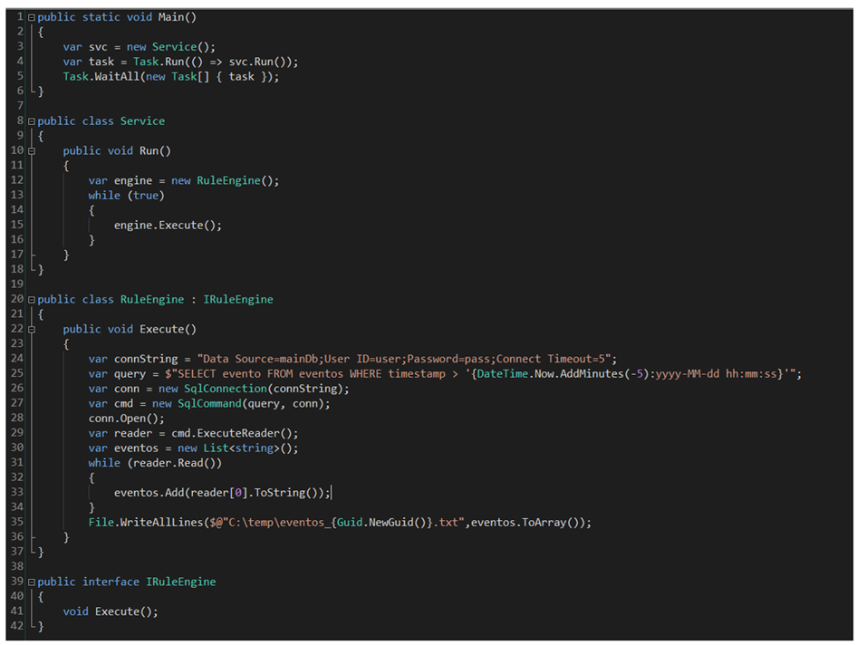

# CASE 1:

## 1. INSTRUÇÕES:
- Você pode e deve executar os códigos abaixo no seu ambiente de desenvolvimento antes de responder os cases.

- Você pode pesquisar qualquer coisa, a qualquer momento. Lembre-se entretanto de atribuir a origem devida caso tenha utilizado código do StackOverflow, etc.

- Escreva tudo o que achar relevante para sua resposta. Não esperamos que responda a prova com código, mas fique à vontade caso queira exemplificar o seu pensamento.

- Os cases apresentados são fictícios. Não há uma única resposta correta. Use o seu próprio julgamento e experiência.

## 2. PROBLEMA:
Uma área de negócios identificou a necessidade de um relatório periódico de eventos. Os eventos são gerados por outros sistemas e são armazenados numa tabela chamada “eventos”.

O time de IT ficou encarregado de desenvolver uma solução. A solução proposta abaixo subiu para produção.

Logo após entrar em produção, os usuários notaram alguns problemas com os arquivos, e pouco tempo depois o time do banco de dados abriu um incidente pois o serviço derrubou o banco de dados.

O serviço foi desativado e você ficou encarregado de resolver os problemas e reestabelecer a funcionalidade para os usuários. O que você faria?

1 – Identifique e descreva a causa raiz do problema. Indique a(s) linha(s) de código problemática(s).

2 – Provisoriamente, como você resolveria o problema para manter a solução operante por pelo menos uma semana? Se você não tem todas as informações disponíveis para tomar uma decisão, liste as premissas ou cenários que você julgue suficientes para entregar o mínimo de funcionalidade para a área de negócios.

3 – Cite pelo menos três melhorias que você implementaria no código. Justifique as alterações e os benefícios que elas trariam.

4 – Você decidiu jogar fora essa solução e resolver o problema de outra maneira. Qual a sua ideia?

Detalhes:
•	O código apresentado roda como um console application dentro de um servidor. Nenhum usuário interage com a aplicação.
•	Os eventos de negócios podem acontecer a qualquer momento.

## 3. RESOLUÇÃO:
1. Consideraria a utilização de Worker Services rodando em segundo plano, executando tarefas onde os usuários não veem.
2. Utilização desnecessária de Task.Run e WaitAll, adicionando complexidade, pode levar a problemas de desempenho.
3. Apesar da simplicidade da aplicação, instância criada diretamente, pode dificultar testes caso seja necessário.
4. Loop executado de forma infinita sem nenhum delay, pode consumir 100% da CPU.
5. Não utilização de try-catch, qualquer falha na execução derruba a aplicação.
6. Conexão sem tratamento de exceção pode causar falhas inesperadas - **senha do banco de dados exposta**.
7. Consulta SQL sem parametrização, vulnerável a SQL Injection.
8. Conexões e recursos não são fechados, conn e reader não são liberados automaticamente, faria utilização de using.
9. Uso de ToArray() em uma lista que pode ser nula, pode causar NullReferenceException.
10. Escrita em arquivo sem verificar se o diretório existe, pode causar DirectoryNotFoundException verificar se o diretório existe e criar se necessário.
11. Falta de logging, não há registro de erros ou informações relevantes sobre falhas ou execução.
12. Os pontos do código que considerei serem um possível problema estão comentados (versão original).

   
## 4. SUGESTÕES TEMPORÁRIAS:
Verificar sugestão de melhoria TEMPORÁRIA na pasta Version2, mas talvez adotasse uma abordagem utilizando Worker Service.

 