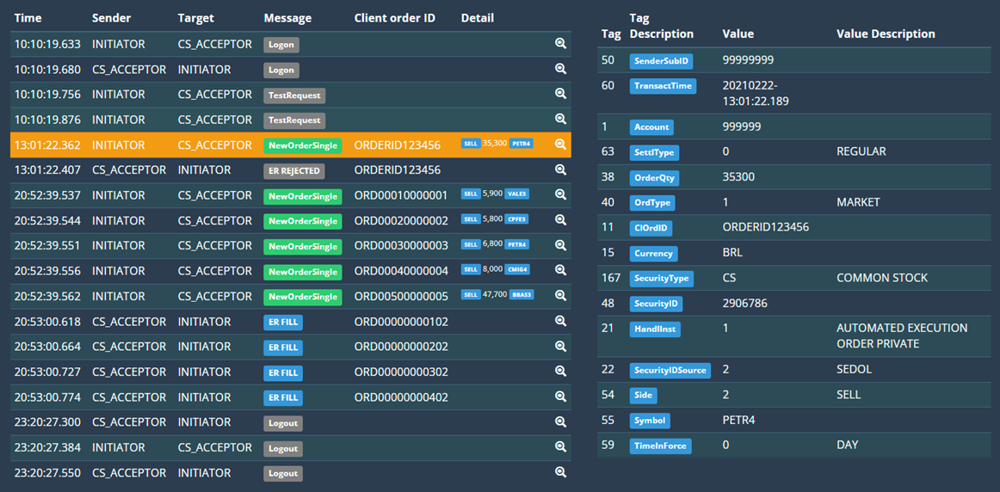

# CASE 2:

## PROBLEMA:
O protocolo eletrônico padrão de comunicação entre participantes do mercado financeiro é o FIX (Financial Information eXchange - Wikipedia).

Uma mensagem FIX é definida como uma série de pares do tipo “chave=valor” em que cada chave é uma tag FIX.

Por exemplo, trocando as chaves dos campos da mensagem abaixo pela descrição de cada tag conforme o dicionário FIX 4.2: Fields by Tag – FIX Dictionary – Onix Solutions

8=FIX.4.2|9=0053|35=0|49=INITIATOR|56=CS_ACCEPTOR|34=1497|52=20210222-21:13:15.661|10=211|

Obtemos a seguinte representação:

BodyLength: 0053
MsgType: HEARTBEAT
SenderCompID: INITIATOR
TargetCompID: CS_ACCEPTOR
MsgSeqNum: 1497
SendingTime: 20210222-21:13:15.661
CheckSum: 211

Duas categorias de mensagens trafegam numa conexão FIX entre contrapartes: mensagens de nível de sessão (session level messages) e mensagens de nível de aplicação (application level messages). As mensagens de nível de sessão, como o exemplo acima, controlam as responsabilidades de manutenção da conexão – heartbeat, logon, logout, etc. – enquanto que as mensagens de nível de aplicação codificam as ações a serem realizadas no mercado, como envio de uma ordem, alteração de uma ordem, cancelamento de ordem, etc.

A tag 35 MsgType <35> field – FIX 4.2 – FIX Dictionary – Onix Solutions é resposável por indicar o tipo da mensagem enviada ou recebida numa conexão FIX.

Abaixo segue um trecho de um arquivo chamado fix_session.summary contendo a stream de mensagens trocadas entre duas contrapartes, INITIATOR e CS_ACCEPTOR. As mensagens de chegada (“ IN”) foram enviadas pelo INITIATOR ao CS_ACCEPTOR. As mensagens de saida (“OUT”) foram enviadas pelo CS_ACCEPTOR ao INITIATOR.

Considere que a contraparte INITIATOR seja um cliente, e a contraparte CS_ACCEPTOR seja a a B3.

# ARQUIVO COMUNICACAO FIX
####################################################################################

IN 20210222-10:10:19.680318000 8=FIX.4.2|9=0062|35=A|49=INITIATOR|56=CS_ACCEPTOR|34=1|52=20210222-10:10:19.633|98=0|108=30|10=087|
OUT 20210222-10:10:19.680318000 8=FIX.4.2|9=62|35=A|49=CS_ACCEPTOR|56=INITIATOR|34=1|52=20210222-10:10:19.680|98=0|108=30|10=249|
IN 20210222-10:10:19.805318800 8=FIX.4.2|9=0078|35=1|49=INITIATOR|56=CS_ACCEPTOR|34=2|52=20210222-10:10:19.756|112=L.0001.0003.0002.101019|10=132|
OUT 20210222-10:10:19.805318800 8=FIX.4.2|9=78|35=0|49=CS_ACCEPTOR|56=INITIATOR|34=2|52=20210222-10:10:19.805|112=L.0001.0003.0002.101019|10=030|
IN 20210222-10:10:19.914694400 8=FIX.4.2|9=0078|35=1|49=INITIATOR|56=CS_ACCEPTOR|34=3|52=20210222-10:10:19.876|112=A.0004.0004.0003.101019|10=130|
OUT 20210222-10:10:19.914694400 8=FIX.4.2|9=78|35=0|49=CS_ACCEPTOR|56=INITIATOR|34=3|52=20210222-10:10:19.914|112=A.0004.0004.0003.101019|10=026|
IN 20210222-10:10:49.914891100 8=FIX.4.2|9=0050|35=0|49=INITIATOR|56=CS_ACCEPTOR|34=4|52=20210222-10:10:49.876|10=057|
OUT 20210222-10:10:49.993015800 8=FIX.4.2|9=50|35=0|49=CS_ACCEPTOR|56=INITIATOR|34=4|52=20210222-10:10:49.993|10=217|
IN 20210222-10:11:19.915086800 8=FIX.4.2|9=0050|35=0|49=INITIATOR|56=CS_ACCEPTOR|34=5|52=20210222-10:11:19.877|10=057|
OUT 20210222-10:11:19.993211500 8=FIX.4.2|9=50|35=0|49=CS_ACCEPTOR|56=INITIATOR|34=5|52=20210222-10:11:19.993|10=216|
...
...
...
IN 20210222-13:01:22.407468100 8=FIX.4.2|9=0189|35=D|49=INITIATOR|56=CS_ACCEPTOR|34=345|52=20210222-13:01:22.362|50=99999999|60=20210222-13:01:22.189|1=999999|63=0|38=35300|40=1|11=ORDERID123456|15=BRL|167=CS|48=2906786|21=1|22=2|54=2|55=PETR4|59=0|10=220|
OUT 20210222-13:01:22.407468100 8=FIX.4.2|9=257|35=8|49=CS_ACCEPTOR|56=INITIATOR|34=346|52=20210222-13:01:22.407|37=NONE|11=ORDERID123456|17=1234567890abcABCefgEFGh==|20=0|150=8|39=8|103=2|1=999999|55=PETR4|54=2|38=35300|40=1|59=0|151=0|14=0|6=0|60=20210222-10:01:22|58=Acc : 999999 N/A for ID: 12345678 and Hndl.I =1|10=222|
...
...
...
IN 20210222-20:52:39.586645900 8=FIX.4.2|9=0211|35=D|49=INITIATOR|56=CS_ACCEPTOR|34=1446|52=20210222-20:52:39.537|50=1234567|60=20210222-20:52:39.529|6000=111|1=3333333|63=0|38=5900|40=1|11=ORD00010000001|15=BRL|167=CS|48=2196286|21=3|22=2|54=2|55=VALE3|58=222|59=0|10=239|
IN 20210222-20:52:39.586645900 8=FIX.4.2|9=0211|35=D|49=INITIATOR|56=CS_ACCEPTOR|34=1447|52=20210222-20:52:39.544|50=1234567|60=20210222-20:52:39.536|6000=111|1=3333333|63=0|38=5800|40=1|11=ORD00020000002|15=BRL|167=CS|48=B031NN3|21=3|22=2|54=2|55=CPFE3|58=222|59=0|10=020|
IN 20210222-20:52:39.602271200 8=FIX.4.2|9=0211|35=D|49=INITIATOR|56=CS_ACCEPTOR|34=1448|52=20210222-20:52:39.551|50=1234567|60=20210222-20:52:39.543|6000=111|1=3333333|63=0|38=6800|40=1|11=ORD00030000003|15=BRL|167=CS|48=2684532|21=3|22=2|54=2|55=PETR4|58=222|59=0|10=252|
IN 20210222-20:52:39.602271200 8=FIX.4.2|9=0211|35=D|49=INITIATOR|56=CS_ACCEPTOR|34=1449|52=20210222-20:52:39.556|50=1234567|60=20210222-20:52:39.549|6000=111|1=3333333|63=0|38=8000|40=1|11=ORD00040000004|15=BRL|167=CS|48=B1YBRG0|21=3|22=2|54=2|55=CMIG4|58=222|59=0|10=067|
IN 20210222-20:52:39.602271200 8=FIX.4.2|9=0212|35=D|49=INITIATOR|56=CS_ACCEPTOR|34=1450|52=20210222-20:52:39.562|50=1234567|60=20210222-20:52:39.556|6000=111|1=3333333|63=0|38=47700|40=1|11=ORD00500000005|15=BRL|167=CS|48=2328595|21=3|22=2|54=2|55=BBAS3|58=222|59=0|10=013|
OUT 20210222-20:53:00.618033400 8=FIX.4.2|9=360|35=8|49=CS_ACCEPTOR|56=INITIATOR|34=5577|50=BLO|52=20210222-20:53:00.618|37=421bb88f-0e61-421a-96d7-56070a236468|11=ORD00000000102|17=8500855330BBDC41|150=2|39=2|1=510962|55=BBDC4|54=1|38=1300|40=1|44=23.1200|15=BRL|59=0|32=100|31=23.12|151=0|14=1300|6=23.1792|60=20210222-20:53:00|21=3|6032=444444|5149=ccccc123456|20=0|5150=0|5151=0|5153=33333|10=109|
OUT 20210222-20:53:00.664908600 8=FIX.4.2|9=360|35=8|49=CS_ACCEPTOR|56=INITIATOR|34=5578|50=BLO|52=20210222-20:53:00.664|37=0c410b95-0580-4cf0-b228-55c2ee232a66|11=ORD00000000202|17=8500855050BBAS32|150=2|39=2|1=510962|55=BBAS3|54=2|38=1400|40=1|44=29.0200|15=BRL|59=0|32=100|31=29.02|151=0|14=1400|6=28.9871|60=20210222-20:53:00|21=3|6032=444444|5149=ccccc123457|20=0|5150=0|5151=0|5153=44444|10=187|
OUT 20210222-20:53:00.727409000 8=FIX.4.2|9=360|35=8|49=CS_ACCEPTOR|56=INITIATOR|34=5579|50=BLO|52=20210222-20:53:00.727|37=f77c4610-6232-4d59-9209-a716aa7c1db4|11=ORD00000000302|17=8500855380BIDI111|150=2|39=2|1=510962|55=BIDI11|54=1|38=300|40=1|44=158.8400|15=BRL|59=0|32=100|31=158.84|151=0|14=300|6=158.91|60=20210222-20:53:00|21=3|6032=444444|5149=ccccc123458|20=0|5150=0|5151=0|5153=555555|10=156|
OUT 20210222-20:53:00.774284200 8=FIX.4.2|9=361|35=8|49=CS_ACCEPTOR|56=INITIATOR|34=5580|50=BLO|52=20210222-20:53:00.774|37=19d3479b-99a4-4479-9e4c-4779fccc4227|11=ORD00000000402|17=8500855080PETR42|150=2|39=2|1=510962|55=PETR4|54=2|38=36600|40=1|44=21.5000|15=BRL|59=0|32=100|31=21.5|151=0|14=36600|6=21.9738|60=20210222-20:53:00|21=3|6032=444444|5149=ccccc123459|20=0|5150=0|5151=0|5153=666666|10=055|
...
...
...
IN 20210222-23:19:45.721533800 8=FIX.4.2|9=0053|35=0|49=INITIATOR|56=CS_ACCEPTOR|34=1750|52=20210222-23:19:45.674|10=218|
OUT 20210222-23:20:05.893803500 8=FIX.4.2|9=53|35=0|49=CS_ACCEPTOR|56=INITIATOR|34=6061|52=20210222-23:20:05.893|10=113|
IN 20210222-23:20:15.722120500 8=FIX.4.2|9=0053|35=0|49=INITIATOR|56=CS_ACCEPTOR|34=1751|52=20210222-23:20:15.674|10=208|
OUT 20210222-23:20:27.300472700 8=FIX.4.2|9=77|35=5|49=CS_ACCEPTOR|56=INITIATOR|34=6062|52=20210222-23:20:27.300|58=OMS is disconnecting|10=142|
IN 20210222-23:20:27.425475100 8=FIX.4.2|9=0080|35=5|49=INITIATOR|56=CS_ACCEPTOR|34=1752|52=20210222-23:20:27.384|58=Logout confirmed (6063)|10=019|
OUT 20210222-23:20:27.550478000 8=FIX.4.2|9=78|35=5|49=CS_ACCEPTOR|56=INITIATOR|34=6063|52=20210222-23:20:27.550|58=Logout acknowledgment|10=145|

####################################################################################

Considerando o funcionamento do protocolo FIX descrito acima e o trecho de arquivo exibido:

- a)	Descreva o output do método GetTimeBucketsDictionary()
- b)	Descreva o conteúdo do arquivo output.csv

## RESOLUÇÃO:
1. Output do método GetTimeBucketsDictionary() é um Dictionary<string, int> contendo todos os segundos definidos entre os horários 10:00:00 (startingDate) e 21:00:00 (targetTime).
2. O conteúdo do arquivo output.csv contém todos os horários do período no formato HH:mm:ss + ',' + contador de mensagens recebidas, caso não haja mensagem o valor é 0.
3. Sistema lê todas as linhas do arquivo fix_session.summary.
4. Filtra apenas as mensagens que começam com " IN" e contêm "35=D".
5. Extrai os 8 caracteres a partir da posição 13, que correspondem ao horário no formato HH:mm:ss.
6. Agrupa essas mensagens por segundo e conta quantas ocorreram em cada segundo.
7. Atualiza o dicionário timeBuckets com essas contagens.
8. Salva o resultado em output.csv.

## CONSIDERAÇÕES:
1. Código considera apenas o horário extraído da posição fixa 13, que corresponde ao timestamp inicial da mensagem.
2. Se houver múltiplas mensagens com o mesmo segundo, elas serão somadas.
3. Dicionário cobre todos os segundos entre 10:00:00 e 21:00:00, mesmo que não tenham mensagens.

## Para maior entendimento, seguem as mensagens trocadas:

