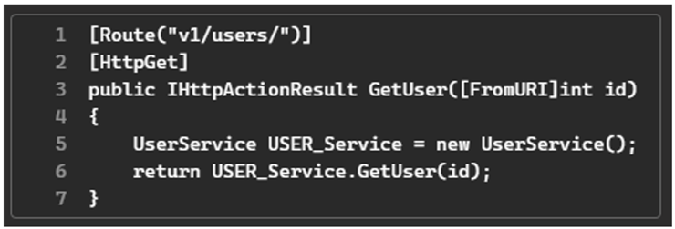

# CASE 3:

## 1. INSTRUÇÕES:
- Você pode e deve executar os códigos abaixo no seu ambiente de desenvolvimento antes de responder os cases.

- Você pode pesquisar qualquer coisa, a qualquer momento. Lembre-se entretanto de atribuir a origem devida caso tenha utilizado código do StackOverflow, etc.

- Escreva tudo o que achar relevante para sua resposta. Não esperamos que responda a prova com código, mas fique à vontade caso queira exemplificar o seu pensamento.

- Os cases apresentados são fictícios. Não há uma única resposta correta. Use o seu próprio julgamento e experiência.

## 2. PROBLEMA:
A rota abaixo retorna um usuario ao fornecer um id. A classe UserService possui o servico responsável por retornar o usuário através do método GetUser(int id).

1 - Considerando boas práticas no desenvolvimento de APIs e de código limpo, quais são os problemas do código apresentado?
 
2 - Qual seria uma das possíveis sugestões de correção? 

## 3. RESOLUÇÃO:
1. Receber o 'id' como um parâmetro da rota, o que é uma prática recomendada para APIs RESTful.
2. Método não está retornando um status HTTP adequado. Retornar 200 (OK) caso usuário seja encontrado.
3. Se usuário não for encontrado, o método pode retornar status 404 (Not Found).
4. Alterar o nome do método para algo mais descritivo, como 'GetById'. Como o nome da controller pode ser 'UserController' talvez nem precise repetir no nome do método.
5. Nome de variável sem um padrão consistente, como por exemplo USER_Service na linha 5. 
6. Pode ser utilizado padrão de nomenclatura como 'camelCase'.
7. Dependa sempre de abstração e não da implementação (DIP), pensando nisso receberia uma interface IUserService no construtor e substituiria o comando 'new' na linha 5.
8. Não utilizar DTOs/Contracts pode levar a problemas de segurança e desempenho, os dados do modelo podem ser expostos diretamente na API.
9. Definiria a rota utilizando o atributo [HttpGet('rota-aqui')], para que seja mais explícita e fácil de entender.

Como sugestão de correções, e uma possível abordagem para API foi desenvolvida uma solução completa e distribuída em camadas.

## 4. INSTRUÇÕES INICIAIS:
1. Na pasta Case3, execute o comando 'docker compose up -d' para subir o container do banco de dados PostgreSQL.
2. Selecionar o projeto **Users.Api** para executar o código.
3. Ao executar o código pela primeira vez, o banco de dados será criado automaticamente e a tabela será populada com alguns dados iniciais.
4. Ao executar o código, a API estará disponível em http://localhost:5003/users/{id}.
5. Utilizar o Postman ou outra ferramenta de API para testar a rota, passando um id para obter o usuário.

## 5. OUTRAS INFORMAÇÕES:
- O código está implementado em C# e utiliza .NET 8 para a construção da API.
- O banco de dados utilizado é o PostgreSQL, e a conexão é feita via docker compose.
- Existem novas abordagens de arquitetura e construção de APIs que utilizam records e não é necessário realizar o mapeamento utilizado neste projeto.-
- Foi criada a interface IDbConnectionFactory para abstrair a conexão com o banco de dados, permitindo que novas implementações possam ser facilmente integradas.
- O projeto de testes não está completo, somente alguns exemplos de testes unitários foram implementados para demonstrar a funcionalidade.
- A solução apresentada é uma abordagem simplificada e pode ser expandida com mais funcionalidades, como autenticação, autorização, validação de entrada, etc.
 
