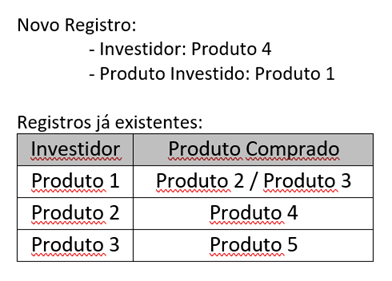

# CASE 5:

## 1. INSTRUÇÕES:
- Você pode e deve executar os códigos abaixo no seu ambiente de desenvolvimento antes de responder os cases.

- Você pode pesquisar qualquer coisa, a qualquer momento. Lembre-se entretanto de atribuir a origem devida caso tenha utilizado código do StackOverflow, etc.
 
- Escreva tudo o que achar relevante para sua resposta. Não esperamos que responda a prova com código, mas fique à vontade caso queira exemplificar o seu pensamento.
 
- Os cases apresentados são fictícios. Não há uma única resposta correta. Use o seu próprio julgamento e experiência.

## 2. PROBLEMA:
Verificações por dependência

A equipe de processamentos reportou um problema em um processo em que o sistema entra em loop infinito e  não consegue realizar um processamento.
Analisando o fluxo e os dados, o analista de TI verificou que há um processamento recursivo por conta de um cadastro que foi realizado de forma errada.

Para solucionar o problema o analista reportou o cadastro errado a área responsável.
No entanto será necessário criar uma rotina que faça essa verificação e retorne se o cadastro pode ou não ser realizado e qual item que já existe no cadastro gera conflito com o novo registro.

Para isso, você deve criar uma function ou uma procedure, que receba os parametros (Investidor e Produto Comprado) e faça as verificações se existe conflito interno dos dados já existentes com os dados novos.

Você pode usar de recursos como cursores, tabelas temporárias, etc.
Como retorno é esperado um status Ok/Não Ok, e um texto informando qual registro já existente gera conflito com os dados novos a serem cadastrados.

Novo Registro:
- Investidor: Produto 4
- Produto Investido: Produto 1

## 3. CONSIDERAÇÕES:
1. Por se tratar de procedure/cursores/tabelas temporárias entendo que tudo deverá ser resolvido nesta camada, inclusive a regra de negócio.
2. É uma base de dados relacional.
3. Não estão sendo consideradas outras tabelas que podem ajudar na verificação.
4. Os valores das colunas Investidor e ProdutoComprado são armazenados na base com o tipo string, porém poderia ser um valor numérico.
5. Em um sistema real seria interessante criar uma tabela de logs para registrar os erros.
6. Validações de integridade referencial podem ser realizadas através de um sistema, retirando regras de negócio de procedures e facilitando criação de testes de unidade.
7. A solução apresentada é uma solução pontual, baseada nas informações fornecidas, para melhor resolução seriam importantes mais informações.

## 4. INSTRUÇÕES INICIAIS:
1. Na pasta Case5, execute o comando 'docker compose up -d' para subir o container do banco de dados SQL Server.

## 5. RESOLUÇÃO:
1. Executar script de criação da tabela e inserção dos dados iniciais.
   **01_Criar_Tabela_Investimentos.sql**

2. Criar a procedure que irá realizar as validações.
   **02_Criar_Procedure_Validacao.sql**

3. Testar procedure via script.
   **03_Testar_Procedure.sql**
    